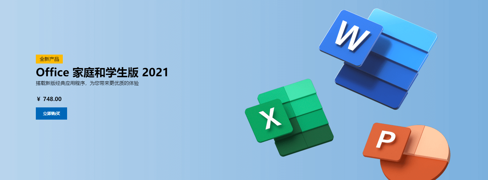

也许是因为压死线赶作业，不幸追尾了 Office 激活过期日。微软提出的和解条件竟然是……

:::info
Migrated from old blog
:::

<!--truncate-->

## 概述

突然发现学校正版软件激活的 Office 过期了，破 vpn 连不上校园网激活平台也登不上去，眼看明天就要交实验报告了。

试图查阅文档解决之，孰料其中门路错综，一查便查了整个下午。

最终还是摆烂重新买了一份 Office。

> 微软 Office 的产品文档是真的是一言难尽……都调去 365 了是吧。
>
> 本文的信息一半来自于文档，一半来自于社区。

## 这个 Office 的世界

Office，没错就是那个 Word、Excel、PowerPoint 和其它奇奇怪怪程序的全家桶。

微软现在有两种 Office：

- Office 20xx
- Microsoft 365

> Microsoft 365 原名 Office 365，在 2020 年 4 月 22 日正式更名。
> 
> 如非特别说明，下文中出现的 Office 均指 Office 20xx。

Microsoft 365 是订阅制的，有最新的功能与安全更新。Office 20xx 则是一次性付款制，每隔几年打包所有新功能，发布一个新版本，然后提供五年的安全更新，不再有功能更新，比如 Office 2019、2021。

## 你这 Office 保熟吗

买新电脑时，我们会问：“你这机子，它送不送 Office 啊？”

商家会回答：“送的，送的。”然后送了一年的 Office 365。

> 现在大概不会有这么缺德的事了

我们期望的送的是正版永久激活 Office 20xx，然而正版 Office 哪有那么便宜能随便送！

一个事实是：买电脑送正版永久激活 Office 只有两种可能，一种是买的是与微软有合作的品牌机，例如联想华硕戴尔，或者亲儿子 Surface；一种是买 Office 的钱其实已经包含在了买电脑的费用里了。

而且但凡是送 Office 许可证的机子，外包装或机箱本体上一定会有明显的贴标。

品牌机送的 Office 许可证一般是 OEM 版本，即臭名昭著的预装版本。不过相比于 OEM Windows 10 的与主板绑死，更换主板即失效，Office 在这一点上要好一些，可以关联到微软账号上。

> 是的，确实可以。你可能会在社区里看到一个说不可以的回答，不要信它，是错的。

关于有无 Office 许可证关联到你的账号上，可以在微软的[服务和订阅](https://account.microsoft.com/services)找到。

当然，如果 Office 许可证尚未关联微软账号，就更换了主板，那可能就得跟商家客服扯皮了。

## 一证多用

Office 许可证是和账号绑定的，因此当然也是可以迁移的。

于是自然就会想：啊那我岂不能一张许可证在好几台机子上反复横跳，一证多用？

虽然 Office 许可证确实是与微软账号关联的，但它依然也绑定到了主板上，只是可以进行解绑，也算是能迁移。但这个过程必须有人工介入，没法直接简单地联网激活了（`激活次数已达到最大允许次数` 报错），必须要**通过电话激活**，相当折腾。

## Fin.

一路摸索到这里已经过去大半个下午了。

再折腾就赶不上作业了，心如死灰之际愤而重新买了一份新许可证。

> 许可证**别直接去官网上买**，一付钱小半个月的生活费就没了（悲）。找国内靠谱的代理渠道商，一般都会有较大的折扣。我买的是 Office 2019，最后在[软购](https://apsgo.com/)上 198 买到，还算可以接受的价格。

……就这样。

莫名其妙浪费了一个下午，钱包受伤，中秋假期也快结束了。

再也不用学校的激活平台了（悲）。
