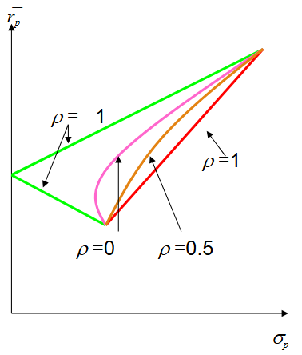
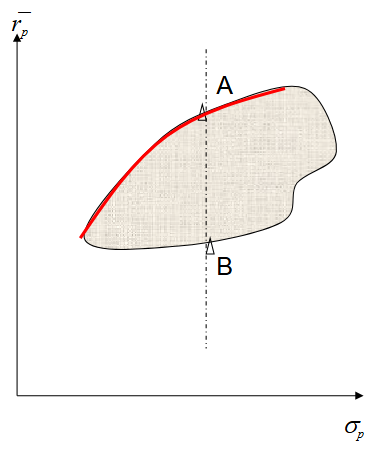
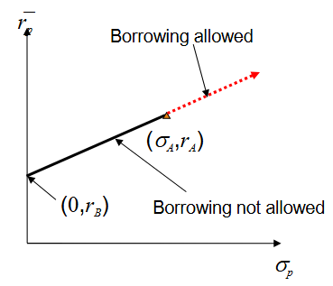
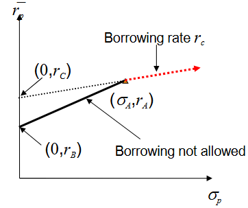
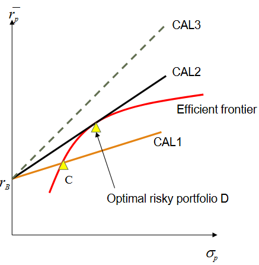

# 2.1 风险

## 现代投资组合理论 MPT

- 风险与回报的权衡
- 通过收益方差来衡量风险
- 均值-方差有效投资组合（Mean-variance efficient portfolio）

## 风险的量化

考虑一个投资，它有 $p_1$ 的概率变化到 $r_1$，有 $p_2$ 的概率变化到 $r_2$。

它的预期收益：

$$
E(r) = \bar{r} = \sum p r
$$

这个投资的风险被定义为：

$$
\sigma = \sqrt{\sum p_i(r_i - \bar{r})^2}
$$

也就是预期收益的标准差（Standard Deviation）。

## 风险厌恶程度的量化

效用函数（Utility function）：一种对具有不同风险/收益特征的投资组合进行排序的方法。在同条件下，效用函数更高的投资组合被认为是更好的。

一个常见的选择是使用：

$$
U = E(r) - \frac{1}{2} A \sigma^2
$$

其中 $A$ 是投资者风险承受能力的衡量指标。

- $A>0$: 风险规避（averse）
- $A=0$: 风险中性（neutral）
- $A<0$: 风险喜好（seeking）

## 投资组合收益与风险的量化

假设投资者已经选定了一些风险资产放入投资组合，并确定了各资产的预期收益 E(r) 与风险 σ。

> 这是一个很大的假设

构建投资组合：

$$
P = \sum v_i S_i
$$

其中 $v_i$ 与 $S_i$ 分别表示资产 $i$ 的持有量和价格。从持有量与价格可以推定各资产的配置权重 $w_i$。

那么，这个投资组合的预期收益就是各资产预期收益的加权：

$$
\bar{r_p} = \sum w_i \bar{r}_i
$$

此外，利用已记录的历史数据，我们可以计算资产间的协方差（Covariance）与相关系数（Correlation）：

$$
\sigma_{ij} = \frac{1}{M} \sum_{k=1}^{M} (r_{ik} - \bar{r}_i)(r_{jk} - \bar{r}_j)
$$

$$
\rho_{ij} = \frac{\sigma_{ij}}{\sigma_i\sigma_j}
$$

进一步的，这个投资组合的方差，也即风险，被确定为：

$$
\sigma_p^2 = \sum_{i=1}^{N} w_i^2 \sigma_i^2 + \sum_{i\neq j}^{N} w_i w_j \sigma_{ij}
$$

投资组合的风险可以被分为两个方面。分别是第一项，由所投资的资产带来的，被称为可分散风险（diversifiable risk）、非系统性风险或特异性风险，可以通过分散投资（$N\rightarrow \inf$）来趋于零；以及第二项，由资产间相关性带来的，也被称为不可分散风险或系统性风险（systematic risk）。

关于系统性风险的讨论将在均衡一章进一步展开。

## 双资产投资组合例

不同的 $\rho$ 会导致一个双资产投资组合在收益-风险图上走出不同的路线。

显然，$\rho$ 越低，通过多样化投资实现的风险降低幅度就更大。

## 可行集合与有效前沿

一个投资组合，通过调整各资产的权重所能取得的 $(\bar{r}_p, \sigma_p)$ 是有界的，我们可以在收益-风险图中以阴影形式标记：

在图中，投资组合 A 在各方面都优于（dominates）投资组合 B，这是因为它在相同风险下能取得更高的预期收益。

图中的标红线被称为有效前沿（Efficient Frontier），也即所有最优的投资组合的集合。

> 取得有效前沿是一个相当复杂的优化问题，特别是当备选的资产数量足够多时。

## 与无风险资产进行组合

记风险投资组合 $(\sigma_A, r_A)$，无风险资产 $(0, r_B)$

由 A 和 B 组成的投资组合 P 将具有以下特征：

$$
\bar{r}_P = \bar{r}_B + \frac{\bar{r}_A - \bar{r}_B}{\sigma_A} \sigma_P
$$

这也是一条经过两点的直线，被称为资本配置线（Capital Allocation Line）。

当 $w_A, w_B > 0$ 时，资产处于实线区域。而当 $w_B<0$ 时，投资者进行了借贷，风险资产的权重可以大于 100%，也即上了杠杆，资产处于虚线区域。

有时，无风险利率与借款利率不同，这会使 CAL 的虚线部分有所改变，如下图所示：

在可行范围内，我们会希望 CAL 越陡越好，这使得承担的每一份风险的价值能最大化，也即夏普比率的最大化。

在上图中，CAL2 是最优的，它选择了有效前沿与无风险资产的切点。而 CAL3 不能实现，因为没有有效的风险资产。

CAL2 与 有效前沿的切点，就是这一模型所给出的最优化资产配置，Optimal Risky Portfolio。

> 为什么需要将风险资产和无风险资产一起考虑：通过组合，可以让投资者根据自身的风险承受能力，在线性水平上调整风险，而不用频繁更换资产配比。

## 实施问题

- 如何降低问题的复杂性？
- 如何为投资组合选择资产？

### 单因素模型

在求有效前沿的过程中，我们需要维护资产的协方差矩阵。这在实际使用中会带来两个问题：

- 协方差矩阵的计算量与大小会随资产增加呈平方的膨胀。
- 可能会带来不一致的结果：
  - 采用数据的线性依赖、样本量不足、微小的噪声等都会导致协方差矩阵存在非正定风险

为了简化问题，假设股票间的联动是由共同的一个或多个因素引起的。

我们可以用一个覆盖面广泛的市值加权指数，例如标普500，作为宏观因子。那么，一个股票的回报被具体定义为：

$$
R_i = \alpha_i + \beta_i R_M + e_i
$$

- $R_i$: 资产 i 的回报
- $\alpha_i$: 资产 i 的预期回报（Expected Return）
- $\beta$: 资产 i 对因子 F 的敏感性
- $e_i$: 资产 i 的非预期回报（Unexpected Return）
- $R_M$: 作为宏观因子的市场指数

上述的构造有以下的性质：

- e 是随机而不可预测的：$E(e_i) = 0$
- 不同资产间的 e 是无关的：$E(e_i e_j) = 0$

于是可以得到在单因素模型下，资产的期望收益与方差：

$$
E(R_i) = \alpha_i + \beta_i E(R_M)
$$

$$
\begin{aligned}
\sigma_i^2 &= E(R_i - E(R_i))^2 \\
&= E \left[ \beta_i(R_M - E(R_M) + e_i) \right]^2 \\
&= \beta_i^2 E(R_M - E(R_M))^2 + E(e_i)^2 \\
&= \beta_i^2 \sigma_M^2 + \sigma_{e_i}^2
\end{aligned}
$$

方差同样分为两部分，市场相关风险（第一项）与股票的特异性风险（第二项）。

采用单因素模型的优势在于，只要确定了每个资产与宏观因素的关系，任意两个资产之间的协方差容易通过 β 推定：$\sigma_{ij} = \beta_i\beta_j\sigma_M^2$，而不再需要根据历史数据去计算维护一整个协方差矩阵。