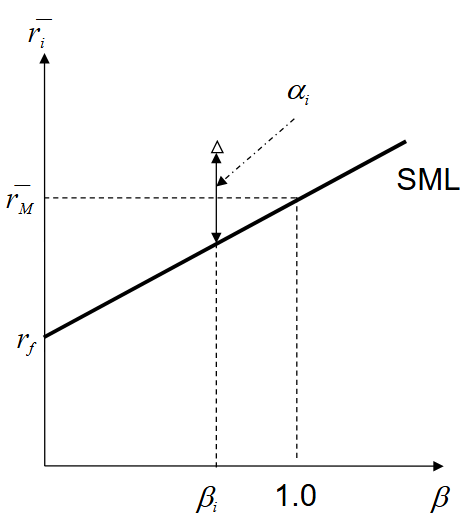

# 2.2 均衡

当市场中的投资者都是理性的，这个市场会表现出什么特性？在这种市场中，预期回报与风险之间是怎样的关系呢。

## Capital Asset Pricing Model

资本资产定价模型 CAPM 是一个著名的关于这一场景构建的理论模型。此模型作了如下假设：

- Mean variance optimization
- non-satiation
- risk averse investors
- availability of risk free assets
- zero taxes and transaction costs
- availability of assets in small fractions
- unrestricted riskless lending and borrowing
- no impact costs in transactions

此模型认为：所有投资者拥有对等的知识、追求夏普比率最大化、对资产收益与风险的看法一致。因此，他们会决策出同一个资产组合。记它为市场组合 Market Portfolio，简记为 M。

市场组合包含了全球市场上所有的可投资风险资产。资产在组合中的占比等于均衡状态下它在市场中的市值占比。

:::note 均衡状态与资产的动态调整

- 假设：投资者发现资产 A 的风险收益比（夏普比率）不如组合中的其他资产
- 行为：理性的投资者会减持资产 A
- 后果：市场上出现了资产 A 的供过于求甚至零需求

此时，由于没有人愿意买入，资产 A 的价格下降，这会直接导致它的预期回报率上升。最终，该资产的夏普比率足够高，于是新的需求重新产生，价格停止下跌。

最终，资产 A 的价格会固定在一个“它必须被包含在市场组合中”的水平上。

当市场中的所有资产的价格都被固定时，市场处于均衡状态。

:::

市场投资组合本质上是一个不可观察的投资组合，因为它只存在于均衡状态下。在现实分析中，作为代理，常用广泛使用市场指数，例如标普 500 指数，以作替代。

回到对投资组合风险的定义：

$$
\sigma_p^2 = \sum_{i=1}^{N} w_i^2 \sigma_i^2 + \sum_{i\neq j}^{N} w_i w_j \sigma_{ij}
$$

这里我们可以认为 N 是极大的，第一项几乎可以忽略。

市场组合以完全的多样性消除了非系统性风险。它承担的唯一风险是整个经济体波动的系统性风险。

于是我们可以定义在 CAPM 视角下，一个几乎消除了非系统性风险的资产，它的预期回报与风险的关系：

$$
\bar{r} = r_f + \beta(\bar{r}_M - r_f)
$$

> 预期回报 = 无风险利率 + β × 预期市场风险溢价

- β：资产的系统性风险，它相对于市场波动的敏感性
  - $\beta = \sigma_P / \sigma_M$
  - β=1：风险与市场同步，即市场组合本身
  - β>1：风险高于市场（进攻型）
  - β<1：风险低于市场（防御型）
  - β<0：看空市场
- $\bar{r}_M - r_f$：市场风险溢价，投资者因承担风险要求的额外补偿

与 CAL 类似，这也是一条关于 $\beta$ 与 $\bar{r}$ 的直线，它被称为证券市场线（Security Market Line）。

市场组合位于 $(1.0, \bar{r}_M)$

## CAPM 与 SML 的作用

对 SML 线的分析能得到，在均衡市场中，任何单一资产或组合的公平价格应该是多少。

给定资产的 beta 值，通过它落在 SML 线上的位置可以找到这一资产在均衡时的预期收益。

如果它的实际收益高于均衡预期收益，也即在 SML 线之上，则该资产是优质的，它在市场上被错误定价，因此存在产生额外回报的空间。

这种额外回报被称为 alpha：

$$
\alpha = \bar{r} - [r_f + \beta (\bar{r}_M - r_f)]
$$

证券分析师的工作是寻找含有过多 alpha 的股票。

CAPM 的本质是“只为系统性风险支付溢价”，它将风险拆解为两方面：

- 非系统性风险：可能出现但不可预料的突发事件引起的风险，但可通过分散持股以尽可能抵消
- 系统性风险：整体市场波动的风险，例如战争、加息、经济衰退，无法抵消

CAPM 认为，既然非系统性风险可以简单通过分散投资抵消，那么市场就不会为这部分风险支付溢价。一个优质投资组合产生的绝大部分收益，应该来自于投资者对大盘的预测能力。

> 来自 Gemini 的总结：只有当你愿意在市场暴跌时一起亏钱，你才配在市场上涨时分一杯羹。
